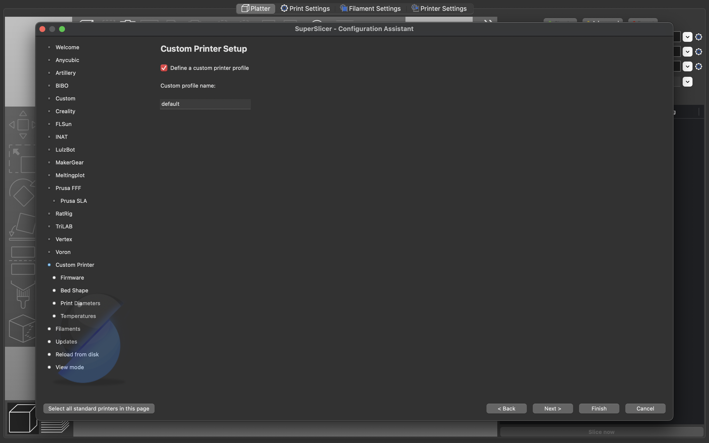

# 3D Printer Configuration Repository

Welcome to our public 3D printer configuration repository! This repository contains configuration files for Augustus(Ender3 V2) at the Makerspace. Each printer has its own branch with specific configuration settings.

## How to use

1. Clone this repo onto your device.

2. Find the location of the .ini file with the name of the printer you wish to use.

3. Install and open the latest [SuperSlicer](https://github.com/supermerill/SuperSlicer) release based on your machine.

4. Open SuperSlicer and follow the instructions

:warning: **WHEN ASKED TO IMPORT PRESETS, CLICK NEXT TILL YOU REACH CUSTOM PRINTER.**

:warning: **CHECK THE BOX THAT SAYS "Define a custom printer profile" and under "Custom profile name:" LABEL IT DEFAULT**

Following this go to Files :arrow_right: Import :arrow_right: Import Config Bundle... :arrow_right: (Select the .ini file as mentioned in point 2 above)

## License

This repository is for internal use only. All rights reserved.

For more information, [contact us](mailto:makerspace+ghq@ashoka.edu.in).
